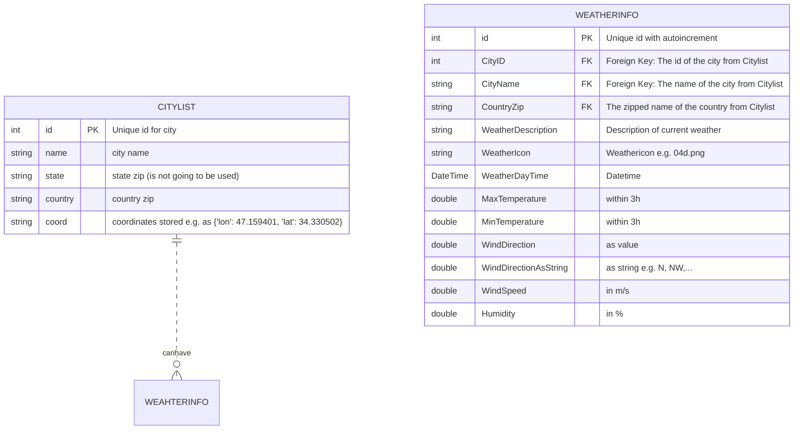
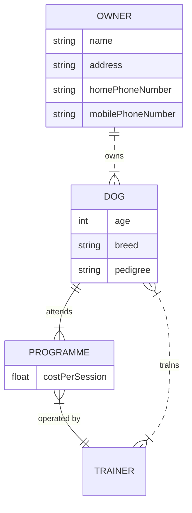

# Data-Structure:

Each city can have 0 or more forecasts. Average/min./max. temperature is going to be received by database.

Example for ER-Diagram:

Information for creating an ER-Diagram

| Value (left) | Value (right) | Meaning                       |
| ------------ | ------------- | ----------------------------- |
| `|o`         | `o|`          | Zero or one                   |
| `||`         | `||`          | Exactly one                   |
| `}o`         | `o{`          | Zero or more (no upper limit) |
| `}|`         | `|{`          | One or more (no upper limit)  |

Keys can be "PK" or "FK", for Primary Key or Foreign Key. And a `comment` is defined by double quotes at the end of an attribute. Comments themselves cannot have double-quote characters in them.
